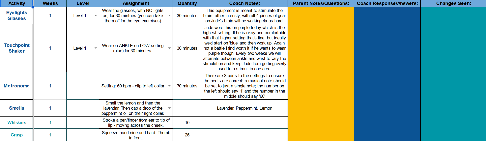
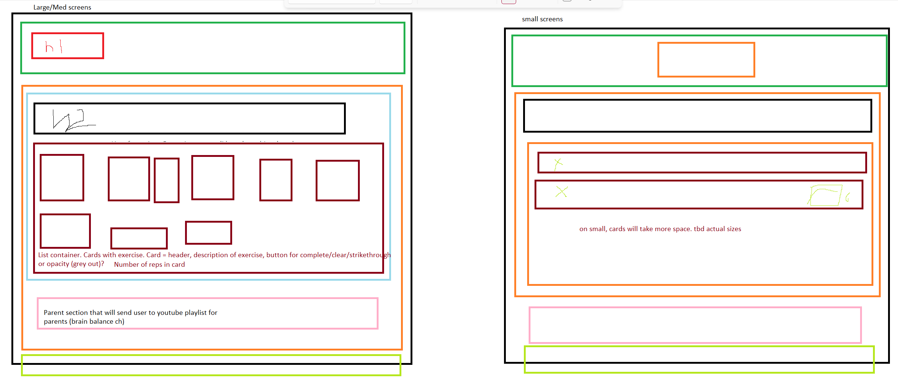
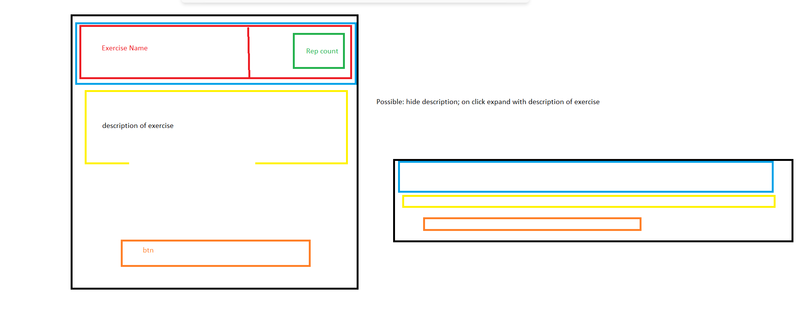
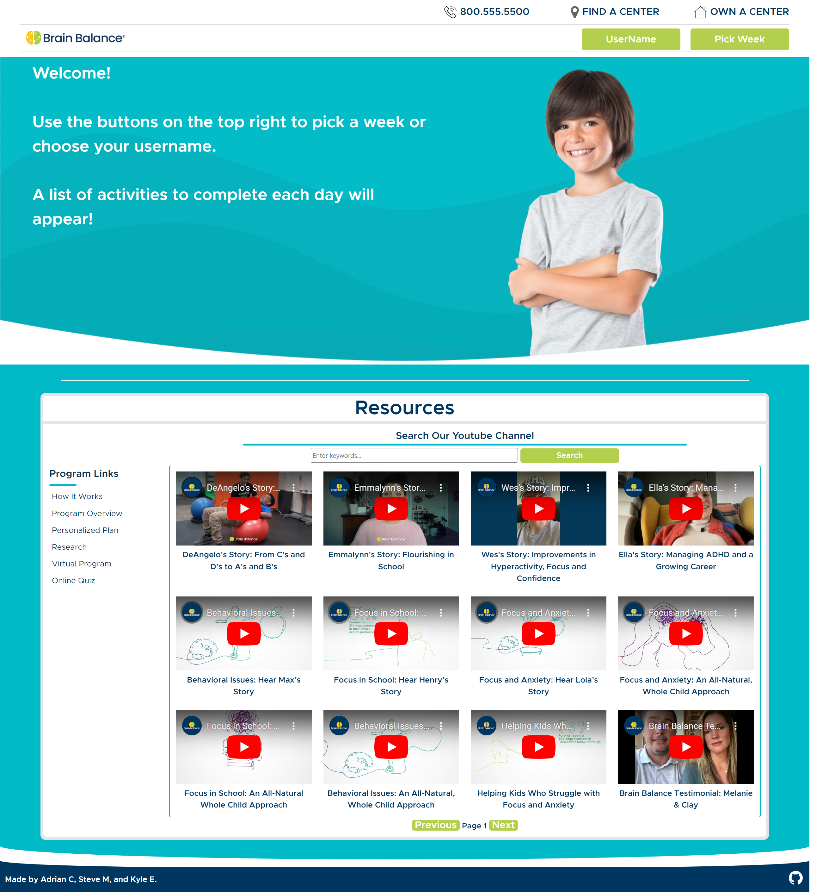
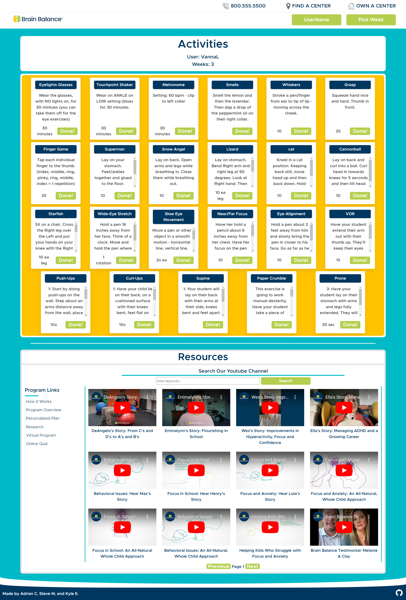

# Brain Balance Activity User Interface
Made by Kyle Etrata, Steve Meyer & Adrian Cheung

## Description
Brain Balance is a company that focuses on patients that want to improve brain functions through engaging the body and mind through exercise. They aim to give their patients exercises that will help develop neural connections from one side of the cerebrum to the other as well as from the motor cortex to the rest of the motor pathways. Currently they deliver their patients their weekly exercises through a google sheet: 

Our project aims to solve the issue of creating a better user experience for patients engaging in Brain Balance's services. Our idea was to start with the following wire-frames and create a dynamic site that will generate the data from the above google sheet and display it on our application in a more interactive way for the user: 

Page Wire-frame:

Card Wire-frame:

Our deployed application can be found [here](https://kyleochata.github.io/Project-1-SAK/). Below are screenshots of the deployed application. We were able to execute from our initial idea and wire-frame and create a site that satisfies our internal acceptance criteria of making the Brain Balance service more interactable and user-friendly than a google sheet with information. A challenge we faced was taking the initial idea and trying to find all the moving pieces to make it a reality.  Another challenge we experienced during this project was working as a part of a team on GitHub. Having to work through the merging and resolving of conflicts took some getting used. 

Deployed Application on load:

Deployed Application after interaction with Username & Weeks buttons:

In the future, if we were to partner with the company to further develop this project, we would like to introduce new technologies to bring the application up to the latest modern standards. Another development we would like to implement in future iterations is to have access to Brain Balance's private library of exercise videos and display them directly to the card for that particular exercise. Other items we would like to see implemented, would be adding a comment section that is tied to the user for the parent/user to interact with their Brain Balance coach, sorting the exercises by category, skill level (etc.); in other words making the application even more user-friendly and giving the user more options to customize their experience with the application. 

## Installation

Locate a suitable place where you would like to download this repository. Once found, copy the repositories SSH or HTTPS to clone through the terminal or download the zipfile from GitHub. After it is downloaded, right-click the index file and launch with your preferred internet browser.

While in the browser, feel free to examine the HTML and CSS code in developer mode by hitting F12 or right-clicking the screen and navigating to inspect.

## Usage

This repository is allowed for use in a learning environment to evaluate and analyze. Please see the license regarding redistribution and commercial use. 

## Credits

Credits are given to the following:

* UCI full-stack coding bootcamp for the acceptance criteria for the project.

* [Rachel](https://github.com/rxtATX) & [Sofia](https://github.com/sofiatejada) for their advisement and help with the project

* [Bulma](https://bulma.io/) for their open CSS framework

* [Google Sheets API](https://console.cloud.google.com/marketplace/product/google/sheets.googleapis.com?project=inspired-gear-397720) 

* [Youtube API](https://developers.google.com/youtube/v3)

## Potential Errors

As of deploying the site, the source code makes use of API keys for both GoogleSheets API and Youtube API. A potential error that you may run into is a 403 error. The most likely cause is that the API call limit has been reached. A way around this error is to supply the code with your own personal Youtube and/or Google API key to get the code working.

## License

Please refer to the license found in the repository.
